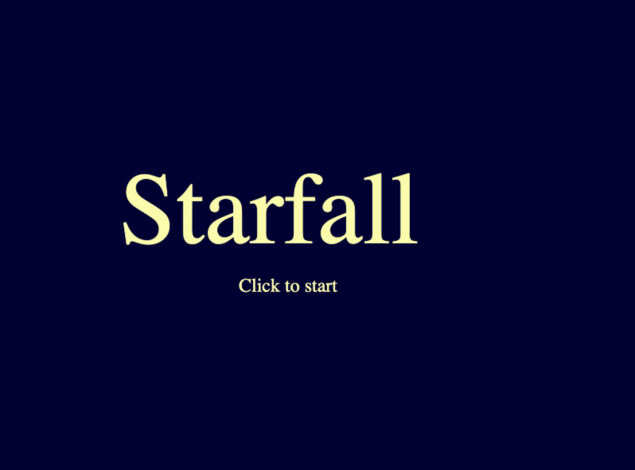

###Starfall

This project is a result of self learning a JS game engine 
[Phaser3](https://github.com/photonstorm/phaser/tree/v3.52.0)
with the help of the 
[tutorial](https://www.freecodecamp.org/news/how-to-build-a-simple-game-in-the-browser-with-phaser-3-and-typescript-bdc94719135/)
on *freecodecamp.org*. Please keep in mind, although I have followed
the tutorial, there are some parts that are different from it.

####How To Build And Run
To build the game you just need to run the command `yarn build` in the root
of this repository, and the project will be built by `webpack`.
Then the bundle can be found under `dist` directory. 

To run the game in you local environment you should run the command `yarn dev`
again in the root of this repository, and the magic will be done by webpack 
once again. Then you should be able to see that webpack has created 
a new tab in your default browser with the action!

####License
[MIT](https://choosealicense.com/licenses/mit/)
